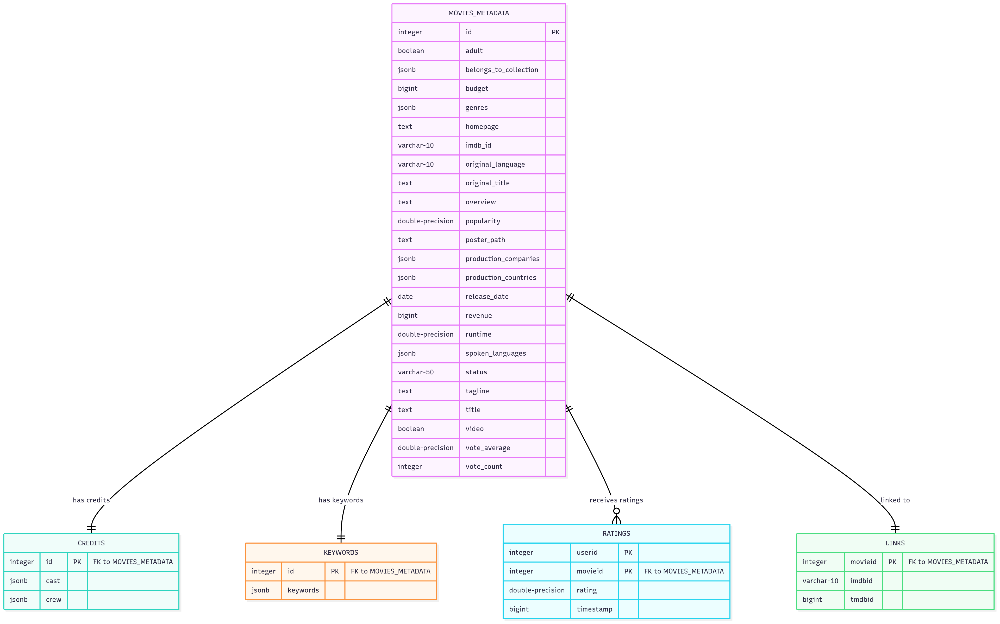

# CinemaMetrics Analytics Platform

## Company Overview

**CinemaMetrics Solutions** is a leading entertainment analytics firm specializing in comprehensive movie industry data analysis. We provide actionable insights to film studios, distributors, and entertainment executives through advanced data visualization and predictive modeling.

## Project Description

This repository contains the core analytics platform for CinemaMetrics' movie database analysis system. Our platform processes extensive movie datasets including:

- **Movie Metadata**: Budget, revenue, genres, release dates, and ratings from [`movies_metadata.csv`](c:\Users\user\VSCode\DV\movies_metadata.csv)
- **Cast & Crew Information**: Detailed credits and casting data from [`credits.csv`](c:\Users\user\VSCode\DV\credits.csv)
- **Keywords & Tags**: Content categorization and thematic analysis from [`keywords.csv`](c:\Users\user\VSCode\DV\keywords.csv)
- **User Ratings**: Individual user ratings and preferences from [`ratings.csv`](c:\Users\user\VSCode\DV\ratings.csv)
- **Rating Links**: Cross-platform rating connections from [`links.csv`](c:\Users\user\VSCode\DV\links.csv)

Our analytics help clients understand market trends, predict box office performance, identify successful genre combinations, and optimize release strategies. The platform generates comprehensive reports using SQL queries for movie performance patterns, actor/director success rates, and genre popularity trends over time.

## Database Schema & Entity Relationships


*Entity-Relationship diagram showing the database structure and relationships between movies, credits, keywords, ratings, and links tables*

## Getting Started

### Prerequisites
- Python 3.8 or higher
- PostgreSQL 12+ 
- Required Python packages (see Tools section below)

### Installation & Setup

1. **Clone the repository**
   ```bash
   git clone https://github.com/yourusername/cinemametrics-analytics.git
   cd cinemametrics-analytics
   ```

2. **Clone the repository**
   Download the dataset from https://www.kaggle.com/datasets/rounakbanik/the-movies-dataset and save the files as queries.sql, movies_metadata.csv, credits.csv, keywords.csv , ratings.csv, links.csv accordingly.

3. **Set up PostgreSQL database**
   ```bash
   # Create database named 'Data'
   createdb Data
   ```

4. **Configure database connection**
   Update the database configuration in [`main.py`](c:\Users\user\VSCode\DV\main.py):
   ```python
   DB_CONFIG = {
       'host': 'localhost',
       'database': 'Data',
       'user': 'postgres',
       'password': 'your_password',
       'port': 5432
   }
   ```

5. **Install Python dependencies**
   ```bash
   pip install pandas psycopg2 numpy
   ```

6. **Run the CSV parser to load data**
   ```bash
   python main.py
   ```
   This will parse and load the movie data from CSV files into PostgreSQL.

7. **Execute analytics queries**
   ```bash
   # Run predefined queries from queries.sql
   psql -d Data -f queries.sql
   ```

### Data Processing

The [`main.py`](c:\Users\user\VSCode\DV\main.py) script contains the `CSVPostgreSQLParser` class that:
- Connects to PostgreSQL database
- Parses CSV files with movie data
- Handles JSON fields in the dataset
- Loads data into structured database tables

## Tools & Technologies

### Data Processing & Analysis
- **Python 3.8+** - Primary programming language
- **Pandas** - Data manipulation and analysis
- **NumPy** - Numerical computing
- **psycopg2** - PostgreSQL database adapter

### Database
- **PostgreSQL** - Primary database system for storing movie data
- **SQL** - Query language for analytics (see [`queries.sql`](c:\Users\user\VSCode\DV\queries.sql))

### Development Tools
- **Git** - Version control
- **Visual Studio Code** - Development environment
- **Logging** - Built-in Python logging for debugging

### Data Sources
The project uses movie industry datasets containing:
- Movie metadata (45,466+ movies)
- Cast and crew credits
- Movie keywords and tags
- User ratings and preferences
- Rating system links

## Project Structure
```
DV/
├── main.py              # Main CSV parser and database loader
├── ER_diagram.png      # Database entity-relationship diagram
└── README.md           # This file
```

## Database Schema

The system processes the following data structures:
- **Movies**: Budget, revenue, genres, release dates, ratings
- **Credits**: Cast and crew information with roles and character names
- **Keywords**: Thematic tags and content categorization
- **Ratings**: User ratings with timestamps and preferences
- **Links**: Cross-platform rating identifiers

## Analytics Capabilities

Current analytics include:
- Movie performance filtering and sorting
- Statistical aggregations by release year
- Cross-table joins for comprehensive analysis
- Revenue and rating trend analysis

## Contact

**CinemaMetrics Solutions**
- Email: analytics@cinemametrics.com
- Website: www.cinemametrics.com

---

*This analytics platform processes real movie industry data to provide insights for entertainment business decisions.*